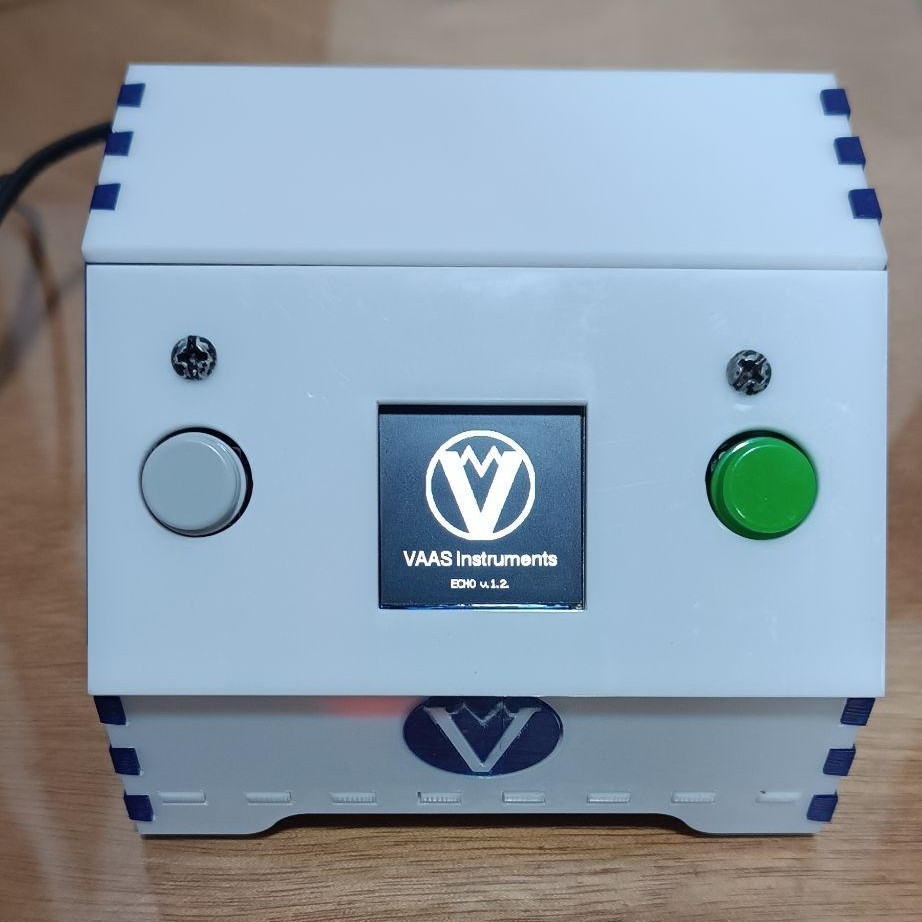

# 🧩 Multifunction Device – ESP32

This project is a multifunction electronic device built around an ESP32 microcontroller. It integrates several independent features into a single standalone system with a TFT display, physical buttons, Wi-Fi, and Bluetooth connectivity.

The device was developed as an experimental and educational project, combining hardware interaction, wireless communication, graphical interfaces, and real-time features on the ESP32 platform.

## ✨ Features

The device includes the following operating modes:

- **Clock Mode**  
  Displays the current time obtained automatically via Wi-Fi. If automatic synchronization fails, the time can be configured manually through a web interface hosted by the device.

- **Photo Frame (Gallery) Mode**  
  Displays a slideshow of images on the TFT screen, cycling automatically every few seconds.

- **Bluetooth Speaker Mode**  
  Enables Bluetooth audio output, allowing the device to function as a wireless speaker when paired with a phone or computer.

- **Flappy Bird Game Mode**  
  A simple implementation of the Flappy Bird game adapted for the TFT display and button-based controls.

All modes are accessible through a main menu and can be exited at any time using the control buttons.

## 🔧 Hardware Overview

- **Microcontroller:** ESP32  
- **Display:** TFT RGB display  
- **Controls:**  
  - Select button (menu navigation / exit)  
  - Start button (confirm / action)
- **Connectivity:**  
  - Wi-Fi (time synchronization and web configuration)  
  - Bluetooth (audio output)
- **Power Supply:**  
  - 5V DC input (2.1 mm connector)  
  - Power switch on the back panel

## 🎛️ User Interface and Controls

- The **left button** is used to navigate through the menu and exit modes.
- The **right button** is used to start or interact with the selected function.
- The main screen displays system messages such as connection status, IP address (for configuration), and active mode information.

## ⏱️ Time Configuration

The device attempts to obtain the current time automatically via Wi-Fi.

If this is not successful:
1. The screen will display the device’s IP address.
2. Enter this IP address in a web browser on the same network.
3. A configuration page will allow manual adjustment of the time and time zone.

## 🔌 Power Requirements

The device must be powered using a **5V power source**. Using an incorrect voltage may damage the hardware.

## 🗂️ Project Structure

This repository contains:
- The complete firmware for the ESP32
- Display logic for multiple modes
- Input handling for physical buttons
- Wireless communication logic (Wi-Fi and Bluetooth)

Due to the number of integrated features, the codebase is relatively dense and tightly coupled to the hardware.

## 🎯 Purpose and Scope

This project was developed as a multifunction prototype to explore the capabilities of the ESP32 in a single embedded system. It is intended for learning, experimentation, and demonstration purposes rather than as a production-ready device.

> **Note:**  
> This project was developed within a limited time frame (approximately one month).  
> The main focus was on feature integration, hardware interaction, and overall system stability rather than extensive refactoring or long-term maintainability.

## 📄 License

This project is licensed under the **MIT License**.  
You are free to use, modify, and distribute this software, provided that the original copyright notice and license are included.

See the `LICENSE` file for more details.

## 👤 Authors

Developed by:
- [Víctor Camilo Cañón Castellanos]
- [Santiago Jesus Gomez Gil]
